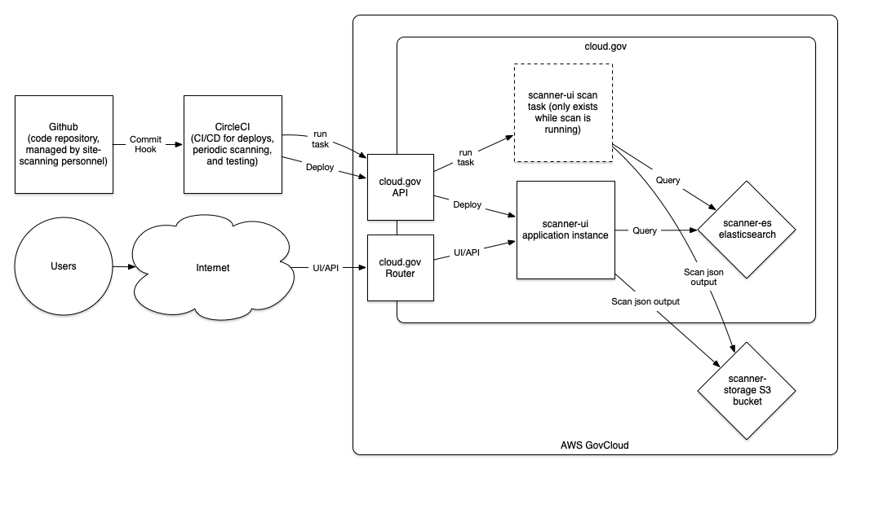

# Architecture

There are three components to Site Scanner:
- *The Scanning Engine:*  This engine, when executed, runs all the configured scans 
  against all of the configured domains and generate json output.
- *Scanning Engine Plugins:*  These are be plugins that let you execute different
  types of scans.  They are be used by the scanning engine, or can be executed by hand.
- *Scan Result UI/API:*  This is a web frontend that also implements a REST API to download/search
  scan results.




## Continuous Deployment

The components are deployed using CircleCI into cloud.gov and once a day, the scanning engine is
executed using https://docs.cloudfoundry.org/devguide/using-tasks.html#run-tasks, generating
it's json files into S3.  The UI then can be used to find and download the scan results.


## Scan Data Storage

The scans are stored on disk as json files named by the domain and placed in a scantype
subdirectory in a public S3 bucket.  The location of the files can be found by querying
the API, like so:
```
$ curl -s https://APPNAME.app.cloud.gov/api/v1/scans/ | jq -r '.[] | .scan_data_url'
https://s3-us-gov-west-1.amazonaws.com/BUCKETNAME/200scanner/18f.gov.json
https://s3-us-gov-west-1.amazonaws.com/BUCKETNAME/200scanner/2020census.gov.json
https://s3-us-gov-west-1.amazonaws.com/BUCKETNAME/200scanner/9-11commission.gov.json
https://s3-us-gov-west-1.amazonaws.com/BUCKETNAME/200scanner/911.gov.json
https://s3-us-gov-west-1.amazonaws.com/BUCKETNAME/200scanner/911commission.gov.json
...
$ 
```

The scans are also indexed into an Elasticsearch instance in cloud.gov, but you must use
[the API](API.md) to access it.
